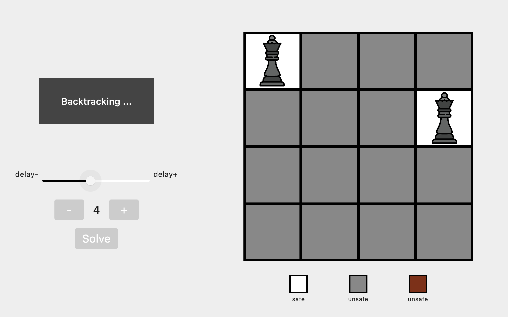
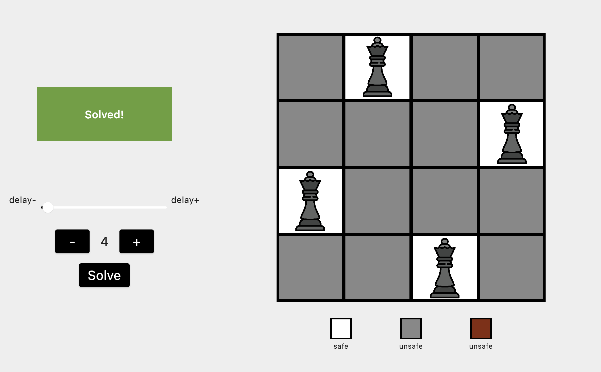
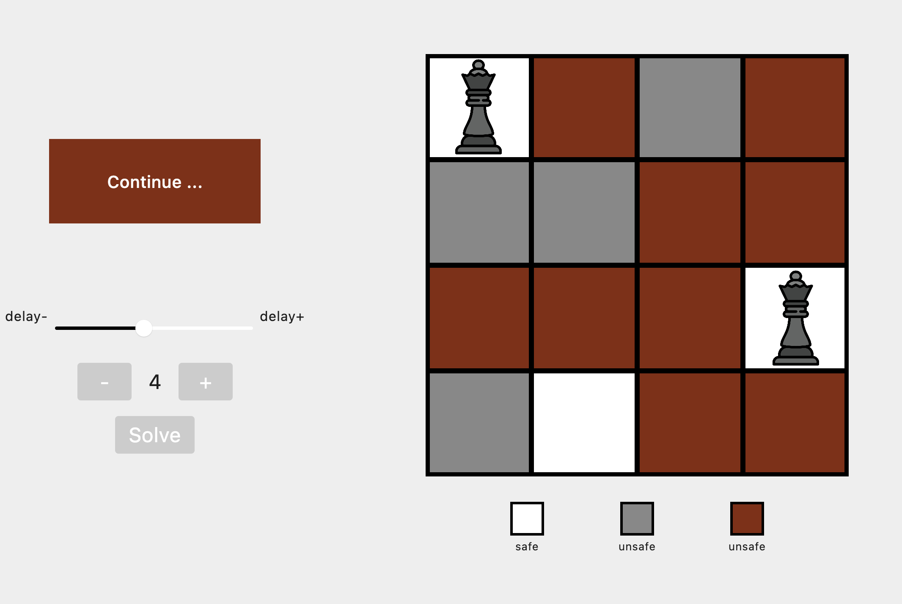

# N-Queen Solver Visualizer in Kotlin with Compose

This project is a visualizer and solver for the N-Queens problem, implemented in Kotlin using Jetpack Compose. The N-Queens problem is a classic puzzle in which you have to place N chess queens on an N×N chessboard so that no two queens threaten each other. Thus, a solution requires that no two queens share the same row, column, or diagonal.




## Features

- **Interactive Visualization:** The visualizer allows you to interactively place queens on the chessboard and see the solutions as you go.
- **Solving Algorithm:** The application uses a backtracking algorithm to find solutions for N-Queens problems.
- **Responsive UI:** Built with Jetpack Compose, the user interface adapts to different screen sizes and orientations.
- **Customizable Board Size:** You can select the size of the chessboard and see how the algorithm performs for different N values.

## Prerequisites

Before running the project, make sure you have the following installed:

- [Android Studio](https://developer.android.com/studio) with Kotlin support.
- An Android emulator or a physical Android device for testing.

## Getting Started

1. Clone the repository to your local machine:

   ```bash
   git clone https://github.com/yourusername/n-queens-solver-visualizer.git
